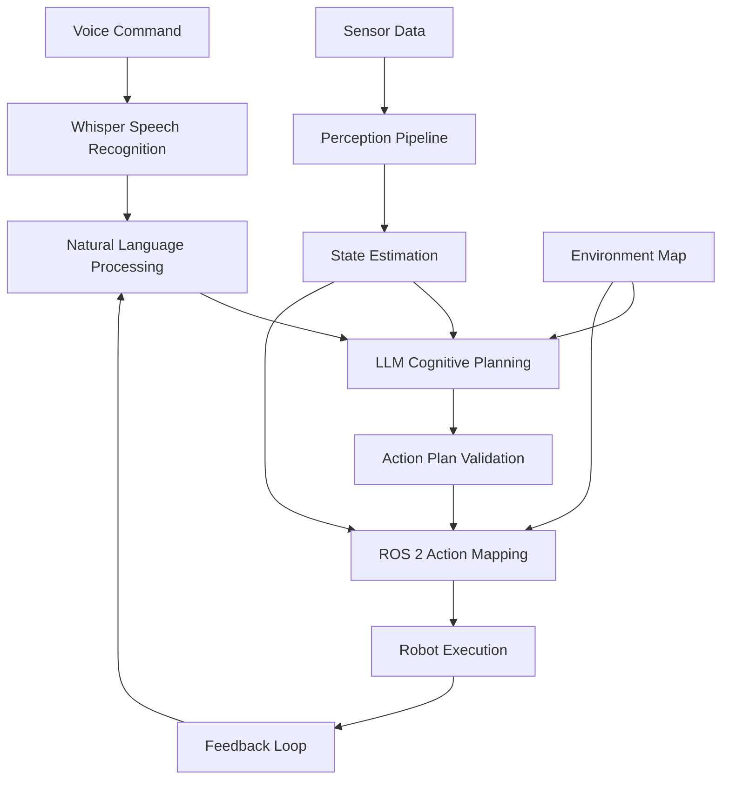

# Module 4, Chapter 3: Capstone - The Autonomous Humanoid

## Overview

This capstone chapter brings together all the components from the previous chapters to create a complete Voice-Language-Action (VLA) system for humanoid robots. We'll build an end-to-end system that accepts voice commands, processes them through large language models for cognitive planning, and executes actions using ROS 2 control systems. This chapter demonstrates how to coordinate all VLA components with ROS 2 for a fully autonomous humanoid robot.

## Complete System Architecture

### VLA System Components

The complete VLA system consists of four main interconnected components:

1. **Voice Recognition Layer**: Converts spoken commands to text using OpenAI Whisper
2. **Language Model Interface**: Processes natural language and generates action plans
3. **Action Execution Layer**: Translates plans to ROS 2 commands for robot control
4. **Coordination Layer**: Orchestrates the complete voice-to-action pipeline



### System Integration Patterns

The VLA system follows a modular architecture pattern:

```python
# Example: Complete VLA system architecture
import rclpy
from rclpy.node import Node
from std_msgs.msg import String
from sensor_msgs.msg import Image, LaserScan
from geometry_msgs.msg import Twist, PoseStamped
from tf2_ros import TransformBuffer, TransformListener
import threading
import queue
import time
from dataclasses import dataclass
from typing import Dict, Any, Optional

@dataclass
class VLACommand:
    """Structured representation of VLA command"""
    id: str
    timestamp: float
    voice_text: str
    parsed_intent: Dict[str, Any]
    action_plan: Optional[Dict] = None
    status: str = "pending"  # pending, processing, executing, completed, failed

class VLASystemCoordinator(Node):
    def __init__(self):
        super().__init__('vla_system_coordinator')

        # Initialize VLA components
        self.voice_recognizer = VoiceRecognizer(self)
        self.language_processor = LanguageModelProcessor(self)
        self.action_planner = ActionPlanner(self)
        self.executor = ActionExecutor(self)
        self.safety_manager = SafetyManager(self)

        # Publishers and subscribers
        self.voice_sub = self.create_subscription(String, '/voice_commands', self.voice_callback, 10)
        self.status_pub = self.create_publisher(String, '/vla_system_status', 10)
        self.feedback_pub = self.create_publisher(String, '/vla_feedback', 10)

        # TF for state estimation
        self.tf_buffer = TransformBuffer(self)
        self.tf_listener = TransformListener(self.tf_buffer, self)

        # Internal state
        self.active_commands = {}
        self.command_queue = queue.Queue()
        self.system_state = {
            'battery_level': 100.0,
            'current_pose': None,
            'obstacles_detected': [],
            'task_in_progress': None
        }

        # Threading for parallel processing
        self.processing_thread = threading.Thread(target=self.process_commands, daemon=True)
        self.processing_thread.start()

        self.get_logger().info("VLA System Coordinator initialized")

    def voice_callback(self, msg: String):
        """Handle incoming voice commands"""
        try:
            # Create command structure
            command = VLACommand(
                id=f"cmd_{int(time.time() * 1000)}",
                timestamp=time.time(),
                voice_text=msg.data,
                parsed_intent={}
            )

            # Add to processing queue
            self.command_queue.put(command)

            # Update status
            self.publish_status(f"Received voice command: {msg.data}")

        except Exception as e:
            self.get_logger().error(f"Error processing voice command: {e}")

    def process_commands(self):
        """Background thread to process commands from queue"""
        while rclpy.ok():
            try:
                # Get command from queue
                command = self.command_queue.get(timeout=0.1)

                # Process command through VLA pipeline
                self.active_commands[command.id] = command
                self.execute_vla_pipeline(command)

            except queue.Empty:
                continue
            except Exception as e:
                self.get_logger().error(f"Error in command processing thread: {e}")

    def execute_vla_pipeline(self, command: VLACommand):
        """Execute complete VLA pipeline for a command"""
        try:
            self.get_logger().info(f"Processing VLA command: {command.voice_text}")

            # Step 1: Parse natural language intent
            self.publish_status("Parsing natural language intent...")
            intent = self.language_processor.parse_intent(command.voice_text)
            command.parsed_intent = intent

            # Step 2: Check safety constraints
            self.publish_status("Checking safety constraints...")
            is_safe, safety_reason = self.safety_manager.validate_intent(intent)
            if not is_safe:
                self.get_logger().warn(f"Safety violation: {safety_reason}")
                self.publish_feedback(f"Command rejected: {safety_reason}")
                command.status = "failed"
                return

            # Step 3: Generate action plan
            self.publish_status("Generating action plan...")
            action_plan = self.action_planner.create_plan(intent, self.system_state)
            command.action_plan = action_plan

            # Step 4: Execute plan
            self.publish_status("Executing action plan...")
            command.status = "executing"
            execution_result = self.executor.execute_plan(action_plan)

            if execution_result.success:
                command.status = "completed"
                self.publish_feedback(f"Command completed: {command.voice_text}")
                self.publish_status("Command completed successfully")
            else:
                command.status = "failed"
                self.publish_feedback(f"Command failed: {execution_result.error}")
                self.publish_status(f"Command failed: {execution_result.error}")

        except Exception as e:
            self.get_logger().error(f"Error in VLA pipeline: {e}")
            command.status = "failed"
            self.publish_feedback(f"System error: {str(e)}")

    def publish_status(self, status: str):
        """Publish system status"""
        status_msg = String()
        status_msg.data = status
        self.status_pub.publish(status_msg)

    def publish_feedback(self, feedback: str):
        """Publish feedback to user"""
        feedback_msg = String()
        feedback_msg.data = feedback
        self.feedback_pub.publish(feedback_msg)

    def update_system_state(self):
        """Update system state from various sensors"""
        # Get robot pose
        try:
            transform = self.tf_buffer.lookup_transform(
                'map', 'base_link', rclpy.time.Time(), timeout=rclpy.duration.Duration(seconds=0.1)
            )
            self.system_state['current_pose'] = transform.transform
        except:
            pass  # Ignore if transform not available

        # Update other state information (battery, sensors, etc.)
        # This would connect to actual robot state topics in a real implementation
```

### Voice Command Processing Pipeline

```python
# Example: Voice command processing pipeline
class VoiceRecognizer:
    def __init__(self, node):
        self.node = node
        self.whisper_model = self._load_whisper_model()

    def _load_whisper_model(self):
        """Load Whisper model for speech recognition"""
        import whisper
        # Use 'base' or 'small' for real-time performance
        return whisper.load_model("base")

    def recognize_speech(self, audio_data):
        """Recognize speech from audio data"""
        # Convert audio data to format suitable for Whisper
        audio_array = self._convert_audio_format(audio_data)

        # Transcribe audio
        result = self.whisper_model.transcribe(audio_array)

        return result["text"]

    def _convert_audio_format(self, audio_data):
        """Convert audio data to format expected by Whisper"""
        # Implementation would convert audio format as needed
        # For now, return the data as-is
        return audio_data

class LanguageModelProcessor:
    def __init__(self, node):
        self.node = node
        self.client = self._initialize_llm_client()

    def _initialize_llm_client(self):
        """Initialize LLM client"""
        import openai
        api_key = self.node.get_parameter_or('openai_api_key', 'dummy_key')
        return openai.OpenAI(api_key=api_key)

    def parse_intent(self, text: str) -> Dict[str, Any]:
        """Parse intent from natural language text using LLM"""

        # Create system prompt for robotic intent parsing
        system_prompt = """
        You are a robotic command interpreter. Parse the following natural language command
        and extract structured intent information for a humanoid robot.

        The output should be a JSON object with these fields:
        {
            "action": "move|navigate|manipulate|perceive|communicate|other",
            "target": "specific object, location, or person",
            "parameters": {
                "distance": float (in meters),
                "direction": "forward|backward|left|right|up|down",
                "speed": float (in m/s),
                "duration": float (in seconds)
            },
            "priority": "high|medium|low",
            "urgency": "immediate|soon|normal"
        }

        Only return the JSON object, nothing else.
        """

        try:
            response = self.client.chat.completions.create(
                model="gpt-4",
                messages=[
                    {"role": "system", "content": system_prompt},
                    {"role": "user", "content": text}
                ],
                temperature=0.1,
                response_format={"type": "json_object"}
            )

            intent_data = json.loads(response.choices[0].message.content)
            return intent_data

        except Exception as e:
            self.node.get_logger().error(f"Error parsing intent: {e}")
            # Return default intent for error case
            return {
                "action": "unknown",
                "target": None,
                "parameters": {},
                "priority": "low",
                "urgency": "normal"
            }

class ActionPlanner:
    def __init__(self, node):
        self.node = node

    def create_plan(self, intent: Dict[str, Any], system_state: Dict[str, Any]) -> Dict[str, Any]:
        """Create action plan based on intent and system state"""

        # Map intent to executable actions
        action_plan = {
            "id": f"plan_{int(time.time() * 1000)}",
            "intent": intent,
            "steps": [],
            "constraints": [],
            "estimated_duration": 0.0
        }

        # Create plan based on action type
        action_type = intent.get("action", "unknown")

        if action_type == "move":
            action_plan["steps"] = self._create_move_plan(intent)
        elif action_type == "navigate":
            action_plan["steps"] = self._create_navigation_plan(intent, system_state)
        elif action_type == "manipulate":
            action_plan["steps"] = self._create_manipulation_plan(intent)
        elif action_type == "perceive":
            action_plan["steps"] = self._create_perception_plan(intent)
        else:
            action_plan["steps"] = self._create_default_plan(intent)

        # Add safety constraints
        action_plan["constraints"] = self._add_safety_constraints(intent)

        return action_plan

    def _create_move_plan(self, intent: Dict[str, Any]) -> list:
        """Create movement plan from intent"""
        steps = []

        # Extract movement parameters
        direction = intent.get("parameters", {}).get("direction", "forward")
        distance = intent.get("parameters", {}).get("distance", 1.0)
        speed = intent.get("parameters", {}).get("speed", 0.3)

        # Add movement step
        steps.append({
            "id": "move_step_1",
            "action": "move_base",
            "parameters": {
                "direction": direction,
                "distance": distance,
                "speed": speed
            },
            "timeout": 30.0,
            "recovery_plan": "stop_and_report"
        })

        return steps

    def _create_navigation_plan(self, intent: Dict[str, Any], system_state: Dict[str, Any]) -> list:
        """Create navigation plan from intent"""
        steps = []

        target = intent.get("target", "")
        if not target:
            self.node.get_logger().error("No target specified for navigation")
            return []

        # Add navigation steps
        steps.append({
            "id": "navigate_to_target",
            "action": "move_base",
            "parameters": {
                "destination": target,
                "speed": 0.3,
                "avoid_obstacles": True
            },
            "timeout": 120.0,
            "recovery_plan": "return_to_origin"
        })

        return steps

    def _create_manipulation_plan(self, intent: Dict[str, Any]) -> list:
        """Create manipulation plan from intent"""
        steps = []

        target = intent.get("target", "")
        if not target:
            self.node.get_logger().error("No target specified for manipulation")
            return []

        # Add perception step to locate object
        steps.append({
            "id": "locate_object",
            "action": "perceive_object",
            "parameters": {"target": target},
            "timeout": 10.0,
            "recovery_plan": "abort_manipulation"
        })

        # Add approach step
        steps.append({
            "id": "approach_object",
            "action": "move_base",
            "parameters": {
                "distance": 0.5,
                "speed": 0.1
            },
            "timeout": 30.0,
            "recovery_plan": "retreat_and_retry"
        })

        # Add manipulation step
        steps.append({
            "id": "manipulate_object",
            "action": "manipulator_control",
            "parameters": {
                "target": target,
                "operation": "grasp"
            },
            "timeout": 30.0,
            "recovery_plan": "release_and_abort"
        })

        return steps

    def _add_safety_constraints(self, intent: Dict[str, Any]) -> list:
        """Add safety constraints based on intent"""
        constraints = []

        # Add constraints based on action type
        action = intent.get("action", "")
        if action in ["navigate", "move"]:
            constraints.append("maintain_safe_distance_from_obstacles")
            constraints.append("validate_navigation_path_feasibility")

        if action == "manipulate":
            constraints.append("validate_object_graspability")
            constraints.append("check_manipulation_safety_zone")

        # Add priority-based constraints
        priority = intent.get("priority", "normal")
        if priority == "high":
            constraints.append("reduce_safety_margins")
        elif priority == "low":
            constraints.append("increase_safety_margins")

        return constraints
```

## End-to-End Voice Command to Action Execution

### Voice Command Processing Flow

The complete flow from voice command to action execution involves several stages:

1. **Audio Capture**: Microphone captures voice command
2. **Speech Recognition**: Whisper converts audio to text
3. **Intent Parsing**: LLM extracts structured intent
4. **Plan Generation**: Action planner creates executable plan
5. **Safety Validation**: Safety manager validates plan
6. **ROS 2 Execution**: Plan executed through ROS 2 interfaces
7. **Feedback Loop**: Results reported back to user

```python
# Example: Complete voice-to-action execution
class VoiceToActionExecutor:
    def __init__(self, node):
        self.node = node
        self.coordinator = VLASystemCoordinator(node)

    def execute_voice_command(self, voice_text: str) -> bool:
        """Execute complete voice command to action flow"""

        self.node.get_logger().info(f"Executing voice command: {voice_text}")

        try:
            # Step 1: Parse intent from voice text
            intent = self.coordinator.language_processor.parse_intent(voice_text)

            # Step 2: Validate safety
            is_safe, reason = self.coordinator.safety_manager.validate_intent(intent)
            if not is_safe:
                self.node.get_logger().warn(f"Command blocked by safety: {reason}")
                self.coordinator.publish_feedback(f"Command blocked: {reason}")
                return False

            # Step 3: Create action plan
            system_state = self.coordinator.system_state
            action_plan = self.coordinator.action_planner.create_plan(intent, system_state)

            # Step 4: Execute plan with feedback
            self.coordinator.publish_status("Executing action plan...")
            result = self.coordinator.executor.execute_plan(action_plan)

            if result.success:
                self.coordinator.publish_status("Command completed successfully")
                self.coordinator.publish_feedback("Command completed successfully")
                return True
            else:
                self.coordinator.publish_status(f"Command failed: {result.error}")
                self.coordinator.publish_feedback(f"Command failed: {result.error}")
                return False

        except Exception as e:
            self.node.get_logger().error(f"Error in voice-to-action execution: {e}")
            self.coordinator.publish_feedback(f"System error: {str(e)}")
            return False

class ActionExecutor:
    def __init__(self, node):
        self.node = node

        # ROS 2 interfaces for robot control
        self.cmd_vel_pub = self.node.create_publisher(Twist, '/cmd_vel', 10)
        self.nav_goal_pub = self.node.create_publisher(PoseStamped, '/move_base_simple/goal', 10)

        # Action clients for more complex tasks
        self.nav_client = ActionClient(self.node, NavigateToPose, 'navigate_to_pose')

    def execute_plan(self, plan: Dict[str, Any]):
        """Execute action plan"""

        result = ExecutionResult(success=True, error="", details=[])

        for step in plan.get('steps', []):
            step_result = self.execute_step(step)

            if not step_result.success:
                result.success = False
                result.error = step_result.error
                result.details.append(f"Step {step['id']} failed: {step_result.error}")

                # Execute recovery plan if available
                recovery_plan = step.get('recovery_plan', 'stop')
                recovery_result = self.execute_recovery(recovery_plan)

                if not recovery_result.success:
                    result.error += f"; Recovery also failed: {recovery_result.error}"
                    break  # Stop execution if recovery fails
            else:
                result.details.append(f"Step {step['id']} completed successfully")

        return result

    def execute_step(self, step: Dict[str, Any]) -> ExecutionResult:
        """Execute individual action step"""

        action_type = step.get('action', 'unknown')
        parameters = step.get('parameters', {})

        try:
            if action_type == 'move_base':
                return self._execute_move_base_step(parameters)
            elif action_type == 'perceive_object':
                return self._execute_perceive_step(parameters)
            elif action_type == 'manipulator_control':
                return self._execute_manipulation_step(parameters)
            elif action_type == 'speak':
                return self._execute_speak_step(parameters)
            else:
                return ExecutionResult(
                    success=False,
                    error=f"Unknown action type: {action_type}",
                    details=[]
                )

        except Exception as e:
            return ExecutionResult(
                success=False,
                error=str(e),
                details=[]
            )

    def _execute_move_base_step(self, params: Dict[str, Any]) -> ExecutionResult:
        """Execute movement step"""

        try:
            # For simple movement, publish velocity commands
            if 'direction' in params and 'distance' in params:
                direction = params['direction']
                distance = params['distance']
                speed = params.get('speed', 0.3)

                # Calculate movement time
                duration = distance / speed

                # Create velocity command
                cmd_vel = Twist()

                if direction == 'forward':
                    cmd_vel.linear.x = speed
                elif direction == 'backward':
                    cmd_vel.linear.x = -speed
                elif direction == 'left':
                    cmd_vel.linear.y = speed
                elif direction == 'right':
                    cmd_vel.linear.y = -speed
                elif direction == 'rotate_left':
                    cmd_vel.angular.z = speed
                elif direction == 'rotate_right':
                    cmd_vel.angular.z = -speed

                # Execute movement
                start_time = self.node.get_clock().now()
                end_time = start_time + rclpy.duration.Duration(seconds=duration)

                while self.node.get_clock().now() < end_time and rclpy.ok():
                    self.cmd_vel_pub.publish(cmd_vel)
                    time.sleep(0.1)  # 10Hz control

                # Stop robot
                stop_cmd = Twist()
                self.cmd_vel_pub.publish(stop_cmd)

                return ExecutionResult(success=True, error="", details=["Movement completed"])

            else:
                # For navigation to specific location
                if 'destination' in params:
                    return self._execute_navigation_to_location(params['destination'])

                return ExecutionResult(
                    success=False,
                    error="Neither direction/distance nor destination specified",
                    details=[]
                )

        except Exception as e:
            return ExecutionResult(
                success=False,
                error=f"Movement execution failed: {str(e)}",
                details=[]
            )

    def _execute_navigation_to_location(self, destination: str) -> ExecutionResult:
        """Execute navigation to specific location"""

        try:
            # In a real implementation, this would look up the destination
            # in a semantic map or use navigation goals
            pose = self._lookup_destination_pose(destination)

            if pose is None:
                return ExecutionResult(
                    success=False,
                    error=f"Destination not found: {destination}",
                    details=[]
                )

            # Publish navigation goal
            self.nav_goal_pub.publish(pose)

            return ExecutionResult(
                success=True,
                error="",
                details=[f"Navigating to {destination}"]
            )

        except Exception as e:
            return ExecutionResult(
                success=False,
                error=f"Navigation failed: {str(e)}",
                details=[]
            )

    def _lookup_destination_pose(self, destination: str) -> Optional[PoseStamped]:
        """Lookup destination pose in semantic map"""
        # This would connect to a semantic map service in a real implementation
        # For now, return a dummy pose based on destination name
        pose = PoseStamped()
        pose.header.frame_id = 'map'
        pose.header.stamp = self.node.get_clock().now().to_msg()

        # Map destinations to approximate coordinates
        if destination.lower() in ['kitchen', 'kitchen_area']:
            pose.pose.position.x = 3.0
            pose.pose.position.y = 2.0
        elif destination.lower() in ['living_room', 'living area']:
            pose.pose.position.x = 1.0
            pose.pose.position.y = 1.0
        elif destination.lower() in ['bedroom', 'bedroom_area']:
            pose.pose.position.x = 5.0
            pose.pose.position.y = 1.0
        else:
            # Default to current position + offset
            pose.pose.position.x = 2.0
            pose.pose.position.y = 0.0

        pose.pose.orientation.w = 1.0  # No rotation

        return pose

    def execute_recovery(self, recovery_type: str) -> ExecutionResult:
        """Execute recovery action"""

        try:
            if recovery_type == 'stop_and_report':
                # Stop robot and report error
                stop_cmd = Twist()
                self.cmd_vel_pub.publish(stop_cmd)
                return ExecutionResult(success=True, error="", details=["Stopped robot"])

            elif recovery_type == 'return_to_origin':
                # Navigate back to origin
                origin = PoseStamped()
                origin.header.frame_id = 'map'
                origin.header.stamp = self.node.get_clock().now().to_msg()
                origin.pose.position.x = 0.0
                origin.pose.position.y = 0.0
                origin.pose.orientation.w = 1.0

                self.nav_goal_pub.publish(origin)
                return ExecutionResult(success=True, error="", details=["Returning to origin"])

            elif recovery_type == 'abort_and_retry':
                # Simply report that we're aborting
                return ExecutionResult(success=True, error="", details=["Aborting and ready to retry"])

            else:
                return ExecutionResult(
                    success=False,
                    error=f"Unknown recovery type: {recovery_type}",
                    details=[]
                )

        except Exception as e:
            return ExecutionResult(
                success=False,
                error=f"Recovery execution failed: {str(e)}",
                details=[]
            )

@dataclass
class ExecutionResult:
    """Result of action execution"""
    success: bool
    error: str
    details: list
```

## Coordinating VLA Components with ROS 2

### ROS 2 Message Passing Patterns

The VLA system uses various ROS 2 message passing patterns to coordinate components:

```python
# Example: ROS 2 coordination patterns for VLA system
import rclpy
from rclpy.qos import QoSProfile, DurabilityPolicy
from std_msgs.msg import String, Bool
from sensor_msgs.msg import Image, LaserScan
from geometry_msgs.msg import Twist, PoseStamped
from action_msgs.msg import GoalStatus
from rclpy.action import ActionClient, ActionServer

class VLAComponentCoordinator:
    def __init__(self, node):
        self.node = node

        # QoS profiles for different communication patterns
        self.reliable_qos = QoSProfile(
            depth=10,
            durability=DurabilityPolicy.TRANSIENT_LOCAL
        )

        self.best_effort_qos = QoSProfile(
            depth=5,
            durability=DurabilityPolicy.VOLATILE
        )

        # Publishers for component coordination
        self.voice_command_pub = self.node.create_publisher(String, '/vla/voice_command', self.reliable_qos)
        self.intent_pub = self.node.create_publisher(String, '/vla/parsed_intent', self.reliable_qos)
        self.action_plan_pub = self.node.create_publisher(String, '/vla/action_plan', self.reliable_qos)
        self.execution_status_pub = self.node.create_publisher(String, '/vla/execution_status', self.reliable_qos)

        # Subscribers for coordination feedback
        self.voice_sub = self.node.create_subscription(
            String, '/voice_commands', self.voice_command_handler, self.reliable_qos
        )
        self.intent_sub = self.node.create_subscription(
            String, '/vla/parsed_intent', self.intent_handler, self.reliable_qos
        )
        self.plan_sub = self.node.create_subscription(
            String, '/vla/action_plan', self.plan_handler, self.reliable_qos
        )
        self.status_sub = self.node.create_subscription(
            String, '/vla/execution_status', self.status_handler, self.best_effort_qos
        )

        # Service servers for component coordination
        self.validate_intent_srv = self.node.create_service(
            String, '/vla/validate_intent', self.validate_intent_callback
        )
        self.generate_plan_srv = self.node.create_service(
            String, '/vla/generate_plan', self.generate_plan_callback
        )

        # Action servers for complex coordinated tasks
        self.vla_execution_action = ActionServer(
            self.node,
            VLAExecution,
            'vla_execute',
            self.execute_vla_goal
        )

        self.get_logger().info("VLA Component Coordinator initialized")

    def voice_command_handler(self, msg: String):
        """Handle incoming voice commands and trigger processing pipeline"""

        self.get_logger().info(f"Received voice command: {msg.data}")

        # Trigger intent parsing
        self.trigger_intent_parsing(msg.data)

    def trigger_intent_parsing(self, voice_text: str):
        """Trigger intent parsing in LLM component"""

        # Publish to LLM processing component
        intent_msg = String()
        intent_msg.data = voice_text
        self.voice_command_pub.publish(intent_msg)

    def intent_handler(self, msg: String):
        """Handle parsed intents and trigger planning"""

        try:
            intent_data = json.loads(msg.data)

            self.get_logger().info(f"Received parsed intent: {intent_data.get('action', 'unknown')}")

            # Trigger action planning
            self.trigger_action_planning(intent_data)

        except json.JSONDecodeError:
            self.get_logger().error(f"Invalid JSON in intent message: {msg.data}")

    def trigger_action_planning(self, intent_data: Dict[str, Any]):
        """Trigger action planning for parsed intent"""

        # Create planning request
        plan_request = String()
        plan_request.data = json.dumps(intent_data)

        # Publish to planning component
        self.intent_pub.publish(plan_request)

    def plan_handler(self, msg: String):
        """Handle generated action plans and trigger execution"""

        try:
            plan_data = json.loads(msg.data)

            self.get_logger().info(f"Received action plan with {len(plan_data.get('steps', []))} steps")

            # Trigger plan execution
            self.trigger_plan_execution(plan_data)

        except json.JSONDecodeError:
            self.get_logger().error(f"Invalid JSON in plan message: {msg.data}")

    def trigger_plan_execution(self, plan_data: Dict[str, Any]):
        """Trigger execution of action plan"""

        # Execute plan through action executor
        executor = ActionExecutor(self.node)
        result = executor.execute_plan(plan_data)

        # Publish execution status
        status_msg = String()
        status_msg.data = json.dumps({
            'success': result.success,
            'error': result.error,
            'details': result.details
        })
        self.execution_status_pub.publish(status_msg)

    def validate_intent_callback(self, request, response):
        """Service callback to validate intent safety"""

        try:
            intent_data = json.loads(request.data)

            safety_manager = SafetyManager(self.node)
            is_safe, reason = safety_manager.validate_intent(intent_data)

            response.data = json.dumps({
                'is_safe': is_safe,
                'reason': reason
            })

            return response

        except Exception as e:
            response.data = json.dumps({
                'is_safe': False,
                'reason': f"Validation error: {str(e)}"
            })
            return response

    def generate_plan_callback(self, request, response):
        """Service callback to generate action plan"""

        try:
            intent_data = json.loads(request.data)

            planner = ActionPlanner(self.node)
            system_state = self.get_system_state()
            action_plan = planner.create_plan(intent_data, system_state)

            response.data = json.dumps(action_plan)
            return response

        except Exception as e:
            response.data = json.dumps({
                'error': f"Plan generation error: {str(e)}"
            })
            return response

    def execute_vla_goal(self, goal_handle):
        """Execute VLA action goal with feedback"""

        try:
            self.get_logger().info(f"Executing VLA goal: {goal_handle.request.command}")

            # Update goal status
            goal_handle.publish_feedback(VLAExecution.Feedback(status="Processing voice command"))

            # Parse voice command
            language_processor = LanguageModelProcessor(self.node)
            intent = language_processor.parse_intent(goal_handle.request.command)

            goal_handle.publish_feedback(VLAExecution.Feedback(status="Validating safety constraints"))

            # Validate safety
            safety_manager = SafetyManager(self.node)
            is_safe, reason = safety_manager.validate_intent(intent)
            if not is_safe:
                goal_handle.abort()
                result = VLAExecution.Result()
                result.success = False
                result.error_message = f"Command blocked by safety: {reason}"
                return result

            goal_handle.publish_feedback(VLAExecution.Feedback(status="Generating action plan"))

            # Generate plan
            planner = ActionPlanner(self.node)
            system_state = self.get_system_state()
            action_plan = planner.create_plan(intent, system_state)

            goal_handle.publish_feedback(VLAExecution.Feedback(status="Executing action plan"))

            # Execute plan
            executor = ActionExecutor(self.node)
            execution_result = executor.execute_plan(action_plan)

            if execution_result.success:
                goal_handle.succeed()
                result = VLAExecution.Result()
                result.success = True
                result.error_message = ""
                result.details = execution_result.details
            else:
                goal_handle.abort()
                result = VLAExecution.Result()
                result.success = False
                result.error_message = execution_result.error
                result.details = execution_result.details

            return result

        except Exception as e:
            self.get_logger().error(f"Error in VLA goal execution: {e}")
            goal_handle.abort()
            result = VLAExecution.Result()
            result.success = False
            result.error_message = f"System error: {str(e)}"
            result.details = []
            return result

    def get_system_state(self) -> Dict[str, Any]:
        """Get current system state for planning"""
        # In a real implementation, this would gather state from various sources
        return {
            'battery_level': 100.0,
            'current_pose': None,
            'obstacles_detected': [],
            'task_in_progress': None
        }
```

### State Management and Coordination

Humanoid robots require careful state management for safe and coordinated operation:

```python
# Example: State management for humanoid VLA system
from enum import Enum
import threading

class RobotState(Enum):
    IDLE = 1
    LISTENING = 2
    PROCESSING_VOICE = 3
    PLANNING_ACTION = 4
    EXECUTING_ACTION = 5
    RECOVERING = 6
    SAFETY_STOP = 7

class HumanoidStateManager:
    def __init__(self, node):
        self.node = node
        self.state = RobotState.IDLE
        self.state_lock = threading.Lock()

        # State publishers
        self.state_pub = self.node.create_publisher(String, '/humanoid/state', 10)
        self.battery_pub = self.node.create_publisher(String, '/humanoid/battery', 10)

        # State subscribers
        self.emergency_stop_sub = self.node.create_subscription(
            Bool, '/emergency_stop', self.emergency_stop_callback, 10
        )

        # Timers for state monitoring
        self.state_monitor_timer = self.node.create_timer(0.1, self.state_monitor_callback)

    def set_state(self, new_state: RobotState):
        """Safely update robot state"""
        with self.state_lock:
            old_state = self.state
            self.state = new_state

            self.node.get_logger().info(f"State transition: {old_state.name} -> {self.state.name}")

            # Publish state change
            state_msg = String()
            state_msg.data = self.state.name
            self.state_pub.publish(state_msg)

    def get_state(self) -> RobotState:
        """Get current robot state"""
        with self.state_lock:
            return self.state

    def can_accept_command(self) -> bool:
        """Check if robot can accept new commands"""
        with self.state_lock:
            return self.state in [RobotState.IDLE, RobotState.LISTENING]

    def state_monitor_callback(self):
        """Monitor robot state and handle transitions"""
        current_state = self.get_state()

        # Check for safety conditions based on state
        if current_state == RobotState.EXECUTING_ACTION:
            # Monitor execution safety
            if self.is_execution_unsafe():
                self.set_state(RobotState.SAFETY_STOP)
                self.execute_safety_procedures()
        elif current_state == RobotState.SAFETY_STOP:
            # Wait for manual reset or safe conditions
            if self.are_safety_conditions_clear():
                self.set_state(RobotState.IDLE)

    def is_execution_unsafe(self) -> bool:
        """Check if current execution is unsafe"""
        # Check various safety conditions:
        # - Battery level too low
        # - Balance parameters outside safe range
        # - Obstacles too close
        # - Unexpected sensor readings

        battery_level = self.get_battery_level()
        if battery_level < 10:  # Less than 10% battery
            self.node.get_logger().warn(f"Low battery: {battery_level}%")
            return True

        # Add other safety checks as needed
        return False

    def are_safety_conditions_clear(self) -> bool:
        """Check if safety stop conditions are resolved"""
        battery_level = self.get_battery_level()
        return battery_level > 20  # Resume if battery above 20%

    def emergency_stop_callback(self, msg: Bool):
        """Handle emergency stop command"""
        if msg.data:  # Emergency stop activated
            self.set_state(RobotState.SAFETY_STOP)
            self.execute_safety_procedures()
        else:  # Emergency stop released
            if self.are_safety_conditions_clear():
                self.set_state(RobotState.IDLE)

    def execute_safety_procedures(self):
        """Execute safety procedures when stopping"""
        # Stop all motion
        cmd_vel = Twist()
        cmd_vel.linear.x = 0.0
        cmd_vel.linear.y = 0.0
        cmd_vel.linear.z = 0.0
        cmd_vel.angular.x = 0.0
        cmd_vel.angular.y = 0.0
        cmd_vel.angular.z = 0.0

        # Publish stop command
        cmd_vel_pub = self.node.create_publisher(Twist, '/cmd_vel', 10)
        cmd_vel_pub.publish(cmd_vel)

        # Log safety event
        self.node.get_logger().warn("Safety procedures executed - robot stopped")

    def get_battery_level(self) -> float:
        """Get current battery level (placeholder implementation)"""
        # In a real implementation, this would get battery data from robot
        return 100.0  # Placeholder
```

## System Limitations and Future Extensions

### Current System Limitations

The VLA system has several important limitations to consider:

1. **Computational Requirements**: LLM processing requires significant computational resources
2. **Latency**: Multi-stage processing introduces delays between command and execution
3. **Ambiguity Resolution**: Natural language can be ambiguous and difficult to interpret
4. **Context Awareness**: Limited ability to maintain complex context across interactions
5. **Safety Constraints**: LLM outputs need careful validation for safety-critical applications

### Addressing Limitations

```python
# Example: Handling system limitations
class VLAQualityManager:
    def __init__(self, node):
        self.node = node
        self.response_times = []
        self.success_rates = []
        self.error_patterns = {}

    def measure_response_time(self, start_time, end_time):
        """Measure and log response time for quality assessment"""
        response_time = end_time - start_time
        self.response_times.append(response_time)

        # Log slow responses
        if response_time > 3.0:  # More than 3 seconds is slow
            self.node.get_logger().warn(f"Slow response time: {response_time:.2f}s")

    def track_execution_success(self, success: bool, command_type: str):
        """Track execution success rates"""
        self.success_rates.append((success, command_type))

        if not success:
            self.error_patterns[command_type] = self.error_patterns.get(command_type, 0) + 1

    def get_performance_metrics(self) -> Dict[str, Any]:
        """Get current performance metrics"""
        if not self.response_times:
            avg_response_time = 0.0
        else:
            avg_response_time = sum(self.response_times) / len(self.response_times)

        if not self.success_rates:
            success_rate = 0.0
        else:
            successful_executions = sum(1 for success, _ in self.success_rates if success)
            success_rate = successful_executions / len(self.success_rates) * 100

        return {
            'average_response_time': avg_response_time,
            'success_rate': success_rate,
            'total_executions': len(self.success_rates),
            'error_distribution': self.error_patterns
        }

class VLASystemOptimizer:
    def __init__(self, node):
        self.node = node
        self.quality_manager = VLAQualityManager(node)

    def optimize_for_latency(self):
        """Optimize system for reduced latency"""
        # Use smaller, faster LLM models for simple commands
        # Cache frequently used plans
        # Optimize sensor data processing pipelines
        pass

    def handle_ambiguous_command(self, command_text: str) -> tuple[bool, str, str]:
        """Handle potentially ambiguous commands"""

        # Check if command is ambiguous
        ambiguity_score = self.assess_command_ambiguity(command_text)

        if ambiguity_score > 0.7:  # Highly ambiguous
            # Ask for clarification
            clarification_needed = self.generate_clarification_request(command_text)
            return False, "Command is ambiguous", clarification_needed
        elif ambiguity_score > 0.4:  # Moderately ambiguous
            # Make best guess but inform user
            best_guess = self.make_best_guess(command_text)
            return True, f"Interpreted as: {best_guess}", best_guess
        else:  # Clear command
            return True, "Command is clear", command_text

    def assess_command_ambiguity(self, command_text: str) -> float:
        """Assess how ambiguous a command is (0.0 to 1.0)"""
        # Simple heuristic - in a real system, this would use more sophisticated NLP
        ambiguous_indicators = [
            'it', 'that', 'there', 'thing', 'stuff',  # Vague references
            '?',  # Questions are often ambiguous
        ]

        ambiguity_score = 0.0

        for indicator in ambiguous_indicators:
            if indicator in command_text.lower():
                ambiguity_score += 0.2

        # Penalize very short commands that might be incomplete
        if len(command_text.split()) < 3:
            ambiguity_score += 0.3

        return min(ambiguity_score, 1.0)

    def generate_clarification_request(self, command_text: str) -> str:
        """Generate a clarification request for ambiguous command"""
        return f"I'm not sure what you mean by '{command_text}'. Could you please be more specific?"

    def make_best_guess(self, command_text: str) -> str:
        """Make best guess for moderately ambiguous command"""
        # In a real implementation, this would use context and heuristics
        return command_text
```

### Future Extensions

The system can be extended in several ways:

1. **Multimodal Integration**: Add vision-based command confirmation
2. **Learning Capabilities**: Adapt to user preferences and common commands
3. **Extended Safety**: More sophisticated safety validation and recovery
4. **Collaborative Robots**: Multi-robot coordination capabilities
5. **Long-term Memory**: Remember user preferences and context across sessions

## Practical Exercise: Complete VLA System Implementation

Let's create a complete working example that demonstrates the full VLA system:

```python
#!/usr/bin/env python3
# Complete VLA system implementation example

import rclpy
from rclpy.node import Node
from std_msgs.msg import String, Bool
from geometry_msgs.msg import Twist
from sensor_msgs.msg import LaserScan
import json
import threading
import time
from dataclasses import dataclass
from typing import Dict, Any, Optional

@dataclass
class VLACommand:
    id: str
    timestamp: float
    voice_text: str
    parsed_intent: Optional[Dict[str, Any]] = None
    action_plan: Optional[Dict[str, Any]] = None
    status: str = "pending"

class CompleteVLASystem(Node):
    def __init__(self):
        super().__init__('complete_vla_system')

        # Initialize all components
        self.voice_recognizer = VoiceRecognizer(self)
        self.language_processor = LanguageModelProcessor(self)
        self.action_planner = ActionPlanner(self)
        self.executor = ActionExecutor(self)
        self.safety_manager = SafetyManager(self)
        self.state_manager = HumanoidStateManager(self)
        self.quality_manager = VLAQualityManager(self)
        self.optimizer = VLASystemOptimizer(self)

        # Publishers and subscribers
        self.voice_sub = self.create_subscription(String, '/voice_commands', self.voice_callback, 10)
        self.status_pub = self.create_publisher(String, '/vla_system_status', 10)
        self.cmd_vel_pub = self.create_publisher(Twist, '/cmd_vel', 10)
        self.scan_sub = self.create_subscription(LaserScan, '/scan', self.scan_callback, 10)

        # Internal state
        self.active_commands = {}
        self.command_queue = queue.Queue()
        self.system_state = {
            'battery_level': 100.0,
            'current_pose': None,
            'obstacles_detected': [],
            'task_in_progress': None
        }

        # Processing thread
        self.processing_thread = threading.Thread(target=self.process_commands, daemon=True)
        self.processing_thread.start()

        # Performance monitoring
        self.performance_timer = self.create_timer(10.0, self.performance_report)

        self.get_logger().info("Complete VLA System initialized and ready")

    def voice_callback(self, msg: String):
        """Handle incoming voice commands"""
        try:
            # Check if system can accept commands
            if not self.state_manager.can_accept_command():
                self.get_logger().warn("System busy, rejecting command")
                return

            # Assess command clarity
            is_clear, message, clarified_command = self.optimizer.handle_ambiguous_command(msg.data)

            if not is_clear:
                self.publish_status(f"Ambiguous command: {message}")
                # In a real system, you'd ask the user for clarification
                # For this demo, we'll reject ambiguous commands
                return

            # Create command structure
            command = VLACommand(
                id=f"cmd_{int(time.time() * 1000)}",
                timestamp=time.time(),
                voice_text=clarified_command
            )

            # Add to processing queue
            self.command_queue.put(command)
            self.active_commands[command.id] = command

            # Update state
            self.state_manager.set_state(RobotState.PROCESSING_VOICE)

            self.get_logger().info(f"Queued command: {command.voice_text}")

        except Exception as e:
            self.get_logger().error(f"Error handling voice command: {e}")

    def scan_callback(self, msg: LaserScan):
        """Update obstacle information from laser scan"""
        # Process scan to detect obstacles
        obstacles = []
        for i, range_val in enumerate(msg.ranges):
            if 0.1 < range_val < 2.0:  # Valid range, within 2m
                angle = msg.angle_min + i * msg.angle_increment
                x = range_val * math.cos(angle)
                y = range_val * math.sin(angle)
                obstacles.append({'x': x, 'y': y, 'distance': range_val})

        self.system_state['obstacles_detected'] = obstacles

    def process_commands(self):
        """Process commands from queue in background thread"""
        while rclpy.ok():
            try:
                command = self.command_queue.get(timeout=0.1)

                start_time = time.time()

                # Process command through VLA pipeline
                success = self.execute_vla_pipeline(command)

                end_time = time.time()

                # Track performance
                self.quality_manager.measure_response_time(start_time, end_time)
                self.quality_manager.track_execution_success(success, command.parsed_intent.get('action', 'unknown') if command.parsed_intent else 'unknown')

                # Update state
                if success:
                    self.state_manager.set_state(RobotState.IDLE)
                else:
                    self.state_manager.set_state(RobotState.RECOVERING)

            except queue.Empty:
                continue
            except Exception as e:
                self.get_logger().error(f"Error in command processing thread: {e}")
                self.state_manager.set_state(RobotState.RECOVERING)

    def execute_vla_pipeline(self, command: VLACommand) -> bool:
        """Execute complete VLA pipeline for command"""
        try:
            self.publish_status(f"Processing: {command.voice_text}")

            # Step 1: Parse intent
            self.publish_status("Parsing intent...")
            intent = self.language_processor.parse_intent(command.voice_text)
            command.parsed_intent = intent

            # Step 2: Validate safety
            self.publish_status("Checking safety...")
            is_safe, reason = self.safety_manager.validate_intent(intent)
            if not is_safe:
                self.get_logger().warn(f"Command blocked by safety: {reason}")
                self.publish_status(f"Blocked: {reason}")
                return False

            # Step 3: Create action plan
            self.publish_status("Planning action...")
            action_plan = self.action_planner.create_plan(intent, self.system_state)
            command.action_plan = action_plan

            # Step 4: Execute plan
            self.publish_status("Executing plan...")
            self.state_manager.set_state(RobotState.EXECUTING_ACTION)

            execution_result = self.executor.execute_plan(action_plan)

            if execution_result.success:
                self.publish_status("Command completed successfully")
                self.publish_feedback(f"Completed: {command.voice_text}")
                return True
            else:
                self.publish_status(f"Execution failed: {execution_result.error}")
                return False

        except Exception as e:
            self.get_logger().error(f"Error in VLA pipeline: {e}")
            self.publish_status(f"System error: {str(e)}")
            return False

    def performance_report(self):
        """Publish periodic performance report"""
        metrics = self.quality_manager.get_performance_metrics()

        report = f"Performance - Avg response: {metrics['average_response_time']:.2f}s, " \
                 f"Success rate: {metrics['success_rate']:.1f}%, " \
                 f"Total executions: {metrics['total_executions']}"

        self.get_logger().info(report)

    def publish_status(self, status: str):
        """Publish system status"""
        status_msg = String()
        status_msg.data = status
        self.status_pub.publish(status_msg)

    def publish_feedback(self, feedback: str):
        """Publish feedback to user"""
        feedback_msg = String()
        feedback_msg.data = feedback
        # In a real system, this might go to a speech synthesis node or display
        pass

def main(args=None):
    rclpy.init(args=args)

    vla_system = CompleteVLASystem()

    try:
        rclpy.spin(vla_system)
    except KeyboardInterrupt:
        vla_system.get_logger().info("Shutting down VLA system...")
    finally:
        vla_system.destroy_node()
        rclpy.shutdown()

if __name__ == '__main__':
    main()
```

## Summary

In this capstone chapter, you've learned how to:
- Build a complete end-to-end VLA system that coordinates voice recognition, language processing, and action execution
- Implement proper ROS 2 message passing patterns for component coordination
- Manage robot state and safety during complex VLA operations
- Address system limitations and plan for future extensions
- Create a complete working system that processes voice commands into robot actions

The complete VLA system provides a foundation for autonomous humanoid robots that can understand natural language commands and execute them safely in real-world environments. This system integrates all the components from previous chapters into a cohesive whole that demonstrates the power of combining voice recognition, large language models, and ROS 2 for advanced humanoid robotics applications.

With this complete system in place, humanoid robots can now respond to natural language commands with intelligent, safe, and context-aware actions, opening up new possibilities for human-robot interaction in both research and practical applications.